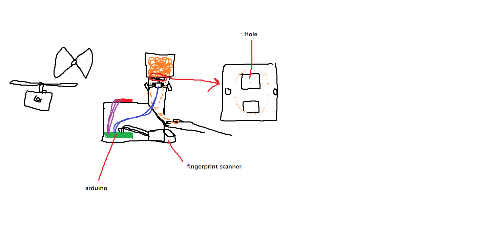
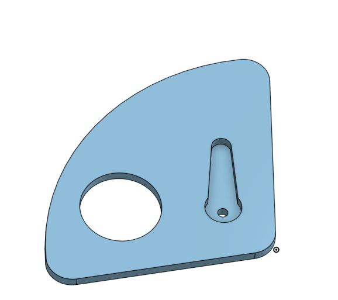
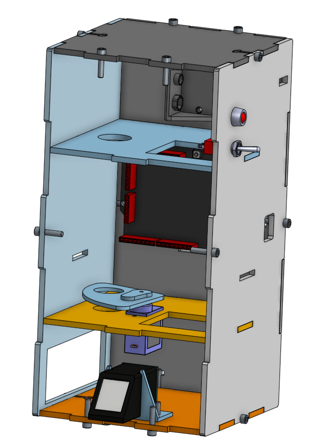

# DicesareNovotneFingerprintDispenser

## Code:
```C++

#include <Servo.h>


#include <Adafruit_Fingerprint.h> //Adding fingerprint sensor libraries
#include <SoftwareSerial.h>

Servo myServo;

SoftwareSerial mySerial(2, 3); // Do I know what's happening here? No. Does it work? Yes.

const int servopin = 9;


Adafruit_Fingerprint finger = Adafruit_Fingerprint(&mySerial);
int fingerprintID = 0;
String IDname; // A bunch of initialization for fingerprint sensor which I only understand very vaguely but a fingerprint sensor is a complicated thing so I don't blame myself
// for using the wonderful feature of ctrl v + ctrl c

void setup() {
    Serial.begin(9600); // Starting the serial monitor, we all know this
    finger.begin(57600); // Starting the fingerprint sensor, don't... ask me why it runs at this speed because I don't know
    
   
    
    if (finger.verifyPassword()) {
      Serial.println("Found fingerprint sensor!");
  } else {                                                        // Checking to see if the fingerprint sensor is there :smile:
      Serial.println("Did not find fingerprint sensor :(");
     while (1) { delay(1); }
  }
}

void loop() {
    fingerprintID = getFingerprintIDez(); // Checks fingerprint to see if correct
    delay(50);
    if(fingerprintID == 1 || fingerprintID == 2){
      Serial.println("wow what a nice finger, so tasty");
      myServo.write(150);
      delay(500);            // does a nice old turn if it's correct
      myServo.write(90);
  }
}
    int getFingerprintIDez() {
   uint8_t p = finger.getImage();
    if (p != FINGERPRINT_OK)  return -1;
  
   p = finger.image2Tz();
   if (p != FINGERPRINT_OK)  return -1;       //gets the fingerprint ID, once again not sure the exact details as to how it works but it's uh yeah it works 

   p = finger.fingerFastSearch();
   if (p != FINGERPRINT_OK)  return -1;
}
```
## !!!!!! IMPORTANT !!!!!! MUST INITALIZE FINGERPRINT SEPARATELY!!!!! 
When using the fingerprint sensor you have to use software from it's library to add your fingerprint to it's database or whatever which is a Pain honestly but there's a good little guide on it here: 
[Enrolling Fingerprints on the Sensor](https://learn.adafruit.com/adafruit-optical-fingerprint-sensor/enrolling-new-users-with-windows)

## Nice old paint diagram




## Onshape Images
### Candy Pusher Part



### Final Assembly



## Onshape Link
[Nice Onshape](https://cvilleschools.onshape.com/documents/a99d3cc9e3b8e59fb0deaeb2/w/b9ca19930aa60ddfe4d9a6b0/e/ae96e00ba1973fc1351a33bd)

## As of the last day of school we have not completed the project
# Here is the rundown:
* We got to printing and cutting the parts of the project but were not able to assemble it in time
* We can account for lack of time somewhat with this year being virtual which certainly hindered things
* Regardleess, there is still steps we could've taken to be more timely
* Even with delegated jobs it is important both members of a group work on whatever task requires the most attention (especially if one member is already done with their part)
* Making sure one has a good grasp of Onshape is important if you're using that because we both were rather bad at it and that slowed us down
* Also making sure your plan is very clear and concise so once you get to modeling it you can put it together quickly
* However the biggest thing which stopped the project was mostly the inability, particularly from me (Ian Novotne) to get into the lab to synthesize the project, due to lack of time
